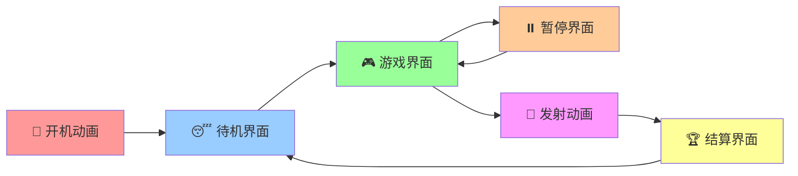
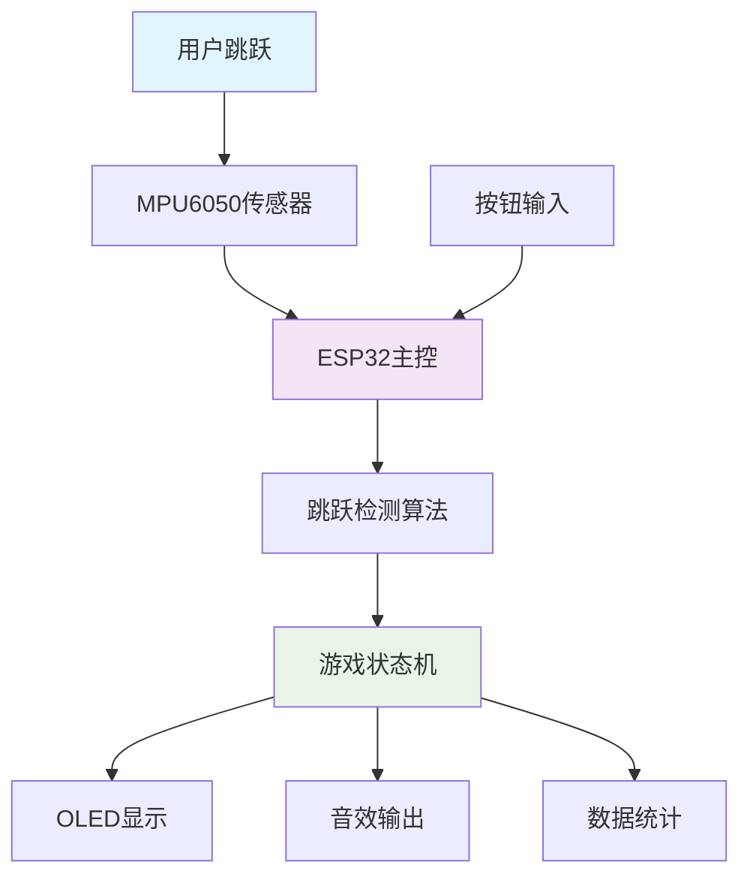

<div align="center">

# 🚀 蹦跳小火箭 ESP32

*基于MPU6050传感器的智能跳跃检测游戏*

[](https://platformio.org/)
[](https://www.espressif.com/)
[](https://www.arduino.cc/)
[](LICENSE)

[](https://github.com/sheacoding/jumpingRocket_esp32/stargazers)
[](https://github.com/sheacoding/jumpingRocket_esp32/network)

[🎮 功能演示](#-功能特性) • [🔧 快速开始](#-快速开始) • [📖 文档](#-项目文档) • [🤝 贡献](#-贡献指南)

</div>

---

## 📖 项目简介

**蹦跳小火箭**是一个创新的ESP32嵌入式游戏项目，通过MPU6050传感器实时检测用户的跳跃动作，将物理运动转化为数字游戏体验。项目采用现代化的UI设计，流畅的动画效果，为用户提供沉浸式的游戏体验。

### 🎯 设计理念

- **🏃‍♂️ 运动游戏化**: 将跳跃运动转化为游戏机制
- **🎨 精美UI**: 基于SVG设计的像素级精确界面
- **⚡ 实时响应**: 50Hz传感器采样，10FPS流畅显示
- **🔊 多感官体验**: 视觉+听觉双重反馈

---

## ✨ 功能特性

<table>
<tr>
<td width="50%">

### 🎮 游戏系统
- **智能跳跃检测**: MPU6050高精度传感器
- **燃料充能机制**: 每次跳跃增加5%燃料
- **动态高度计算**: 实时显示飞行高度
- **完整游戏流程**: 6个精心设计的游戏状态

</td>
<td width="50%">

### 🖥️ 显示系统
- **128×64 OLED**: 高对比度单色显示
- **SVG精确布局**: 像素级完美对齐
- **丰富动画效果**: 呼吸灯、波纹、闪烁等
- **10FPS流畅显示**: U8g2图形库优化

</td>
</tr>
<tr>
<td width="50%">

### 🔊 音效系统
- **多种音效**: 跳跃、发射、胜利音效
- **PWM蜂鸣器**: 高质量音频输出
- **动态音效**: 根据游戏状态自动播放

</td>
<td width="50%">

### 🎛️ 交互系统
- **单按钮控制**: 简洁的交互设计
- **多种操作**: 短按、长按不同功能
- **状态反馈**: 实时显示操作结果

</td>
</tr>
</table>

---

## 🎬 界面展示

<div align="center">

### 游戏界面流程



</div>

| 界面 | 功能描述 | 特色效果 |
|------|----------|----------|
| 🚀 **开机动画** | 系统启动欢迎界面 | 三点依次闪烁 + 火箭图标 |
| 😴 **待机界面** | 等待用户开始游戏 | 呼吸灯效果 + 状态显示 |
| 🎮 **游戏界面** | 主要游戏交互界面 | 实时统计 + 波纹反馈 + 进度条 |
| ⏸️ **暂停界面** | 游戏暂停状态 | 闪烁边框 + 三列统计 |
| 🚀 **发射动画** | 火箭升空动画 | 动态高度显示 + 升空特效 |
| 🏆 **结算界面** | 游戏结果展示 | 优化布局 + 完整统计 |

---

## 🔧 快速开始

### 📋 硬件清单

| 组件 | 型号 | 数量 | 说明 |
|------|------|------|------|
| 🔌 **主控板** | ESP32 DevKit | 1 | 主控制器 |
| 📡 **传感器** | MPU6050 | 1 | 6轴陀螺仪+加速度计 |
| 🖥️ **显示屏** | SSD1306 OLED 128×64 | 1 | I2C接口 |
| 🔊 **蜂鸣器** | 无源蜂鸣器 | 1 | PWM音效输出 |
| 🔘 **按钮** | 轻触开关 | 1 | 用户交互 |
| 🔋 **电源** | 锂电池/USB | 1 | 供电系统 |

### 🔌 接线图

```
ESP32 DevKit    ←→    外设
─────────────────────────────
GPIO 21         ←→    SDA (OLED & MPU6050)
GPIO 22         ←→    SCL (OLED & MPU6050)
GPIO 18         ←→    蜂鸣器正极
GPIO 19         ←→    按钮 (另一端接GND)
3.3V            ←→    OLED & MPU6050 VCC
GND             ←→    所有设备 GND
```

### ⚡ 安装步骤

1. **克隆项目**
   ```bash
   git clone https://github.com/sheacoding/jumpingRocket_esp32.git
   cd jumpingRocket_esp32
   ```

2. **安装PlatformIO**
   ```bash
   # 使用pip安装
   pip install platformio
   
   # 或使用VSCode扩展
   # 搜索并安装 "PlatformIO IDE"
   ```

3. **编译上传**
   ```bash
   # 编译项目
   pio run
   
   # 上传到ESP32
   pio run --target upload
   
   # 监控串口输出
   pio device monitor --port COM6 --baud 115200
   ```

4. **开始游戏** 🎮
   - 连接硬件按照接线图
   - 上电启动，观看开机动画
   - 跳跃开始游戏！

---

## 📊 技术架构

### 🏗️ 系统架构



### 📈 性能指标

| 指标 | 数值 | 说明 |
|------|------|------|
| **RAM使用** | 7.2% (23,700 bytes) | 内存占用优化 |
| **Flash使用** | 26.1% (342,753 bytes) | 代码存储空间 |
| **传感器采样** | 50Hz | MPU6050数据读取频率 |
| **显示刷新** | 10FPS | OLED界面更新频率 |
| **动画帧率** | 20FPS | 特效动画流畅度 |
| **响应延迟** | <50ms | 跳跃检测到显示反馈 |

### 🔧 核心算法

#### 跳跃检测算法
```cpp
// 基于加速度变化的跳跃检测
bool detectJump(float accel_z) {
    static float filtered_accel = 1.0f;
    
    // 低通滤波
    filtered_accel = FILTER_ALPHA * filtered_accel + 
                    (1.0f - FILTER_ALPHA) * accel_z;
    
    // 跳跃检测逻辑
    if (filtered_accel > JUMP_THRESHOLD_HIGH) {
        // 检测到跳起
        return true;
    }
    return false;
}
```

---

## 📖 项目文档

### 📚 详细文档

- 📋 [**SVG映射表**](SVG_MAPPING_TABLE.md) - UI设计到代码的精确映射
- 🔧 [**硬件调试指南**](HARDWARE_DEBUG.md) - 硬件连接和调试方法
- 🎨 [**UI布局指南**](UI_LAYOUT_GUIDE.md) - 界面设计和布局规范
- 🚀 [**重构总结**](SVG_REFACTOR_FINAL.md) - 项目重构过程和成果

### 🎨 设计文件

- 🖼️ [**UI设计文档**](doc/rocket_ui_design.svg) - 完整的界面设计SVG文件
- 🏗️ [**系统架构图**](doc/rocket_system_architecture.svg) - 系统架构设计图

### 📝 开发日志

- ✅ **v2.0** - 基于SVG设计的完整重构
- ✅ **v1.5** - 动画系统优化
- ✅ **v1.0** - 基础功能实现

---

## 🤝 贡献指南

我们欢迎所有形式的贡献！

### 🐛 报告问题

如果您发现了bug或有改进建议：

1. 查看 [Issues](https://github.com/sheacoding/jumpingRocket_esp32/issues) 是否已有相关问题
2. 创建新的Issue，详细描述问题
3. 提供复现步骤和环境信息

### 🔧 提交代码

1. Fork 本仓库
2. 创建功能分支 (`git checkout -b feature/AmazingFeature`)
3. 提交更改 (`git commit -m 'Add some AmazingFeature'`)
4. 推送到分支 (`git push origin feature/AmazingFeature`)
5. 创建 Pull Request

### 📋 开发规范

- 遵循现有的代码风格
- 添加必要的注释和文档
- 确保代码通过编译测试
- 更新相关文档

---

## 📄 许可证

本项目采用 MIT 许可证 - 查看 [LICENSE](LICENSE) 文件了解详情。

---

## 🙏 致谢

- **ESP32社区** - 提供优秀的开发平台
- **PlatformIO** - 现代化的嵌入式开发环境
- **U8g2库** - 高效的图形显示库
- **Adafruit** - 优质的传感器库支持

---

<div align="center">

**⭐ 如果这个项目对您有帮助，请给我们一个星标！**

Made with ❤️ by [sheacoding](https://github.com/sheacoding)

</div>
